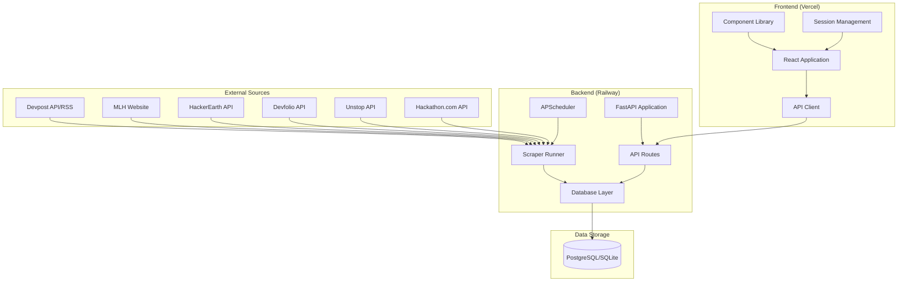

# Design Document

## Overview

HackRadar is architected as a modern full-stack web application with clear separation between data aggregation, API services, and user interface layers. The system follows a microservices-inspired approach with the backend handling all data operations and the frontend providing a responsive, interactive user experience.

The architecture prioritizes reliability, scalability, and maintainability through async programming patterns, robust error handling, and clean API design. The platform is designed to handle high-frequency data updates while providing real-time user interactions.

## Architecture

### System Architecture



### Technology Stack

**Backend:**
- **FastAPI**: Modern, fast web framework with automatic API documentation
- **SQLAlchemy 2.0**: Async ORM for database operations
- **APScheduler**: Background task scheduling for periodic scraping
- **aiohttp**: Async HTTP client for web scraping
- **BeautifulSoup4**: HTML parsing for MLH scraper
- **feedparser**: RSS parsing for Devpost fallback

**Frontend:**
- **React 18**: Component-based UI library
- **React Router v6**: Client-side routing
- **date-fns**: Date manipulation utilities
- **lucide-react**: Icon library
- **Vite**: Build tool and development server

**Infrastructure:**
- **Railway**: Backend hosting with PostgreSQL
- **Vercel**: Frontend hosting with CDN
- **SQLite**: Development database
- **PostgreSQL**: Production database

## Components and Interfaces

### Backend Components

#### 1. Scraper System

**ScraperRunner** (`scrapers/runner.py`)
- Orchestrates all scraper execution
- Implements concurrent scraping with asyncio
- Handles error aggregation and logging
- Manages database upserts

**Individual Scrapers** (`scrapers/*.py`)
- Each scraper implements async function returning `List[dict]`
- Standardized data format for hackathon records
- Platform-specific parsing logic
- Graceful error handling with empty array fallback

```python
# Scraper Interface
async def scrape_hackathons() -> List[dict]:
    """
    Returns list of hackathon dictionaries with standardized fields:
    - title, source, url, image_url, description
    - prize_pool, location, mode, tags
    - team_size_min, team_size_max
    - registration_deadline, start_date, end_date
    """
```

#### 2. Database Layer

**Database Models** (`database.py`)
- Hackathons table with comprehensive metadata
- Planner table for user scheduling
- Async connection management
- Environment-based database selection

**Data Access Patterns**
- Repository pattern for data operations
- Async context managers for connections
- Prepared statements for performance
- Transaction management for data consistency

#### 3. API Layer

**Route Handlers** (`routers/*.py`)
- RESTful endpoint implementations
- Request validation with Pydantic models
- Response serialization
- Error handling middleware

**API Design Principles**
- Consistent response formats
- Proper HTTP status codes
- Pagination for large datasets
- Query parameter validation

### Frontend Components

#### 1. Core Pages

**ListingPage** (`pages/ListingPage.jsx`)
- Main hackathon discovery interface
- Integrates filtering, search, and pagination
- Responsive grid layout
- Infinite scroll or load-more pagination

**DetailPage** (`pages/DetailPage.jsx`)
- Comprehensive hackathon information display
- Integration with planner system
- External registration links
- Responsive design for all screen sizes

**PlannerPage** (`pages/PlannerPage.jsx`)
- Full-featured agenda builder
- Timeline visualization
- Form-based item creation/editing
- Calendar export functionality

#### 2. Reusable Components

**HackCard** (`components/HackCard.jsx`)
- Standardized hackathon display component
- Source-specific styling
- Deadline urgency indicators
- Action buttons for navigation

**FilterBar** (`components/FilterBar.jsx`)
- Multi-category filtering interface
- Pill-based selection UI
- State management for active filters
- Future feature placeholders

#### 3. Utility Systems

**API Client** (`api.js`)
- Centralized HTTP request handling
- Environment-based URL configuration
- Error handling and retry logic
- Response data transformation

**Session Management** (`lib/session.js`)
- Anonymous user identification
- localStorage-based persistence
- UUID generation for new sessions
- Cross-tab session sharing

## Data Models

### Hackathon Entity

```sql
CREATE TABLE hackathons (
    id TEXT PRIMARY KEY,              -- md5(source + url)
    title TEXT NOT NULL,
    source TEXT NOT NULL,             -- platform identifier
    url TEXT NOT NULL,
    image_url TEXT,
    description TEXT,
    prize_pool TEXT,
    location TEXT,                    -- "Online" or "City, Country"
    mode TEXT,                        -- online|offline|hybrid
    tags JSON,                        -- ["AI", "Web3", "HealthTech"]
    team_size_min INTEGER,
    team_size_max INTEGER,
    registration_deadline DATETIME,
    start_date DATETIME,
    end_date DATETIME,
    status TEXT DEFAULT 'upcoming',   -- upcoming|ongoing|past
    scraped_at DATETIME
);
```

### Planner Entity

```sql
CREATE TABLE planner (
    id TEXT PRIMARY KEY,
    hackathon_id TEXT REFERENCES hackathons(id),
    session_id TEXT NOT NULL,         -- localStorage UUID
    title TEXT NOT NULL,
    start_time DATETIME NOT NULL,
    end_time DATETIME NOT NULL,
    description TEXT,
    type TEXT,                        -- idea|build|submit|sleep|review|meeting
    color TEXT,
    created_at DATETIME
);
```

### Data Relationships

- **One-to-Many**: Hackathon → Planner Items
- **Session-based**: Planner Items grouped by session_id
- **Temporal**: All entities include timestamp fields for auditing

## Error Handling

### Backend Error Strategy

**Scraper Resilience**
- Individual scraper failures don't affect others
- Network timeouts with configurable limits
- Malformed data handling with validation
- Comprehensive logging for debugging

**API Error Responses**
- Standardized error format with codes
- Appropriate HTTP status codes
- User-friendly error messages
- Request validation errors

**Database Error Handling**
- Connection retry logic
- Transaction rollback on failures
- Constraint violation handling
- Migration error recovery

### Frontend Error Strategy

**Network Error Handling**
- Retry logic for failed requests
- Offline state detection
- Loading state management
- User-friendly error messages

**Component Error Boundaries**
- Graceful degradation for component failures
- Error reporting without full page crashes
- Fallback UI components
- Development vs production error display

**Form Validation**
- Client-side validation for immediate feedback
- Server-side validation for security
- Field-level error display
- Accessibility-compliant error messaging

## Testing Strategy

### Backend Testing

**Unit Tests**
- Individual scraper function testing
- Database operation testing
- API endpoint testing
- Utility function testing

**Integration Tests**
- End-to-end scraper workflow
- Database migration testing
- API route integration
- External service mocking

**Performance Tests**
- Concurrent scraper execution
- Database query optimization
- API response time benchmarks
- Memory usage profiling

### Frontend Testing

**Component Tests**
- Individual component rendering
- User interaction testing
- Props and state management
- Accessibility compliance

**Integration Tests**
- Page-level functionality
- API integration testing
- Routing behavior
- Session management

**End-to-End Tests**
- Complete user workflows
- Cross-browser compatibility
- Mobile responsiveness
- Performance benchmarks

### Testing Tools and Frameworks

**Backend**
- pytest for unit and integration tests
- pytest-asyncio for async test support
- httpx for API testing
- factory_boy for test data generation

**Frontend**
- Jest for unit testing
- React Testing Library for component tests
- Cypress for end-to-end testing
- Lighthouse for performance testing

## Performance Considerations

### Backend Optimization

**Scraping Performance**
- Concurrent execution with asyncio
- Connection pooling for HTTP requests
- Rate limiting to respect source APIs
- Caching for frequently accessed data

**Database Performance**
- Indexed columns for common queries
- Connection pooling
- Query optimization
- Pagination for large result sets

**API Performance**
- Response caching for static data
- Compression for large responses
- Efficient serialization
- Background task processing

### Frontend Optimization

**Loading Performance**
- Code splitting by routes
- Lazy loading for components
- Image optimization and lazy loading
- Bundle size optimization

**Runtime Performance**
- Virtual scrolling for large lists
- Debounced search inputs
- Memoized expensive calculations
- Efficient re-rendering patterns

**User Experience**
- Skeleton loading states
- Optimistic UI updates
- Progressive enhancement
- Offline functionality preparation

## Security Considerations

### Backend Security

**API Security**
- CORS configuration for cross-origin requests
- Rate limiting for API endpoints
- Input validation and sanitization
- SQL injection prevention

**Data Security**
- Environment variable management
- Secure database connections
- Audit logging for sensitive operations
- Error message sanitization

### Frontend Security

**Client-side Security**
- XSS prevention through React's built-in protection
- Secure session management
- Environment variable handling
- Content Security Policy headers

**Data Privacy**
- Anonymous session management
- No personal data collection
- Secure API communication
- GDPR compliance considerations

## Deployment Architecture

### Backend Deployment (Railway)

**Configuration**
- Nixpacks automatic buildpack detection
- Environment variable injection
- PostgreSQL plugin integration
- Health check endpoints

**Scaling Strategy**
- Horizontal scaling capability
- Database connection pooling
- Background task distribution
- Resource monitoring

### Frontend Deployment (Vercel)

**Configuration**
- Vite build optimization
- SPA routing configuration
- Environment variable management
- CDN distribution

**Performance Optimization**
- Static asset optimization
- Gzip compression
- Cache headers configuration
- Edge function utilization

### Monitoring and Observability

**Application Monitoring**
- Health check endpoints
- Performance metrics collection
- Error tracking and alerting
- Usage analytics

**Infrastructure Monitoring**
- Database performance metrics
- API response time tracking
- Resource utilization monitoring
- Uptime monitoring